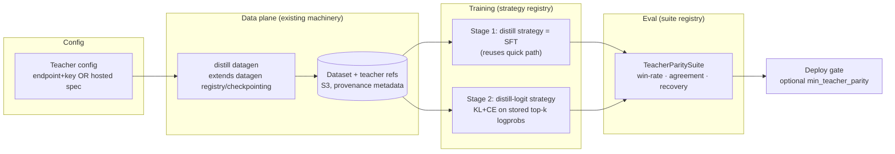

# Distillation — Design Spec

> Status: **Stages 1–3 implemented** (`feat/distillation-stage1`, `-stage2`, `-stage3`). What each stage measured rather than assumed is in [STAGE2-SPIKE-FINDINGS.md](STAGE2-SPIKE-FINDINGS.md) and [STAGE3-SPIKE-FINDINGS.md](STAGE3-SPIKE-FINDINGS.md); how to verify them is in [STAGE2-TESTING.md](STAGE2-TESTING.md) and [STAGE3-TESTING.md](STAGE3-TESTING.md). Stage 3 has not yet run on a GPU — that gap is itemized in its testing doc. Companion: [RESEARCH.md](RESEARCH.md) (the evidence behind every decision here).
> Scope: multi-tenant, production-grade distillation as a first-class training capability.

---

## 1. Goal

Let a user turn a **large teacher model** into a **small student model they own**, on their data, with **proof of how much of the teacher survived** — without ML expertise.

Three staged capabilities, each independently shippable and useful:

| Stage | Capability | Teacher requirement | New ML surface |
| --- | --- | --- | --- |
| **1** | Sequence-level distillation (SeqKD) + **teacher-parity report** | Any OpenAI-compatible endpoint (black-box) | None (reuses SFT) — new eval suite |
| **2** | Offline logit/KL distillation | Self-hosted open-weight teacher (vLLM on Modal), exact tokenizer/template match | New KD loss in trainer |
| **3** | On-policy distillation (GKD-style) | Self-hosted teacher server + student trainer coordination | New training loop topology |

**Non-goals (now):** feature/hidden-state distillation (obsolete for decoder LLMs), cross-tokenizer logit KD (research-grade; revisit when TRL's GOLD stabilizes), pruning+distill (enterprise-scale stack), speculative-decoding draft training (future serving optimization).

## 2. Design rules derived from research

1. **Start black-box, upgrade white-box.** >90% of real-world distillation is SFT on curated teacher traces; logit/on-policy KD is a *quality upgrade* on top, not the entry point. Stage order follows this.
2. **API teachers are text-only.** Providers cap `top_logprobs` ≤ 20 (research: <25 can be worse than no distillation; useful range ≈128–320) and offer no `prompt_logprobs`. So logit KD *requires* a self-hosted teacher — which our Modal scale-to-zero pattern handles naturally.
3. **Logit KD requires exact tokenizer/template identity.** Same-family is only a hint (Qwen→Qwen, Llama→Llama), not a guarantee. Validate tokenizer artifacts and chat-template behavior by hash; cross-family or mismatched artifacts → Stage 1 automatically.
4. **Curation beats volume.** 1K curated traces can beat 100K raw ones. Distillation datasets flow through the existing Data Studio review/rating loop — this is our leverage, not a new build.
5. **Parity, not vibes — but parity is not correctness.** Every distillation run produces a teacher-parity report (judge win/tie-rate vs teacher, answer agreement, teacher-recovery). Parity alone can certify faithful mimicry of a *wrong* teacher, so deploy gates always combine parity with the existing truth metrics (golden-holdout lift, benchmark scores, base-model regression) — parity is an additional gate, never a replacement.
6. **Provenance + ToS as product policy.** Record teacher identity/params immutably on every dataset and job. Providers carry policy metadata — `allowed | restricted | unknown` — driving UI behavior (open-weight Apache-2.0/MIT teachers: `allowed` and recommended as defaults; known proprietary APIs: `restricted` with an explicit acknowledgment; anything else: `unknown` with a notice). Honor the Llama naming clause when Llama is the teacher.
7. **Judge ≠ teacher.** Using the teacher to judge student-vs-teacher comparisons is biased. The judge stays the tenant's configured judge LLM; warn in UI if judge == teacher.

## 3. Architecture — where it plugs in (all existing seams)



| Change | Where | Nature |
| --- | --- | --- |
| `TrainingMode::Distill` | `crates/shared/src/enums.rs` | New enum variant → ts-rs regenerates TS union |
| Teacher config DTO + validation | API service layer | New request fields; key encrypted with existing `SecretCipher` |
| `distill` datagen activity | `apps/workers/src/activities/` + `apps/workers/src/datagen/` | New activity using the current datagen registry/checkpoint path; reuse `generate_pairs` helpers where they are still canonical |
| `@register_strategy("distill")` | `train_model.py` | Stage 1: thin wrapper over the SFT path |
| `@register_strategy("distill_logit")` | new strategy module | Stage 2: KD loss (KL+CE on stored logprobs) |
| `TeacherParitySuite` | `run_evaluation.py` (`@register_suite`) | New suite beside existing ones |
| `GateMetric::TeacherParity` | `deploy_gate.rs` | Optional threshold, fail-closed like the others |
| Teacher hosting job | Modal GPU provider path | Stage 2/3: vLLM teacher, per-job, scale-to-zero |

No architectural surgery. The workflow shape (chunk → generate → train → evaluate) is unchanged.

## 4. Teacher abstraction

One new concept, two flavors:

```text
TeacherConfig
├── kind: "endpoint"                      # Stage 1 — any OpenAI-compatible API
│   ├── api_base_url, api_key (encrypted at rest, enc:v1), model
│   └── notes: ToS notice shown for known proprietary hosts
└── kind: "hosted"                        # Stage 2/3 — we run it
    ├── model_id (open-weight, from our catalog), precision (fp8/int4/bf16)
    ├── gpu spec (defaulted by model size: 32B→1×H100 fp8, 70B→2×H100 fp8)
    └── top_k_logprobs (default 128)
```

- **Teacher choice is explicit and required — no silent default.** The picker offers the tenant's configured LLM as a one-click suggestion, but the user must actively select a teacher, so provenance is always intentional. Provider-policy classification runs on whatever is chosen; `restricted`/`unknown` require explicit acknowledgment.
- Stored per-job, not global — different projects can use different teachers.
- Provenance: `teacher_model`, `teacher_kind`, generation params are written into dataset metadata and the training job record.

## 5. Stage 1 — SeqKD + parity report (the shippable core)

**User story:** "Point at a strong model, give it my documents/examples, get a small model + a report saying how close it is to the teacher."

### Pipeline

1. **Generate:** teacher answers prompts derived from user documents (existing chunk→facet→generate machinery) *or* re-answers an existing dataset's prompts. **Teacher reasoning traces (CoT) are opt-in, never default** — proprietary teachers often expose only summarized reasoning, terms may restrict training on it, and traces are a provenance liability. The UI recommends enabling CoT only when the task type is reasoning *and* the teacher is open-weight/self-hosted. Runs through the existing checkpointed, heartbeated activity; records curated via Data Studio like any dataset.
2. **Hold out:** golden-holdout split as today — **plus the teacher's own answers on the holdout prompts are generated and stored now** (so parity eval never needs to re-call the teacher).
3. **Train:** `distill` mode = SFT on the teacher dataset (existing quick/SFT path, unchanged hyperparameters).
4. **Evaluate:** existing suites (tuned-vs-base) **plus** `TeacherParitySuite`:
   - **Judge win/tie-rate** student vs stored teacher answers on holdout (existing `compare_ab`, blind).
   - **Answer agreement** (existing `check_correctness` against teacher answer as reference).
   - **Teacher-recovery** = student score ÷ teacher score per benchmark suite where teacher scores exist.
5. **Report:** parity metrics land in the evaluation record → UI parity panel; optional `DEPLOY_MIN_TEACHER_PARITY` gate.

### Failure/crash review (per Correctness-over-Convenience)

- Teacher generation: already checkpointed per-chunk; teacher outage → existing retry/circuit-breaker path; permanent provider errors already reported verbatim.
- Parity eval never depends on teacher availability (answers stored at datagen time).
- Teacher API spend is on the user's key (their provider bill), same as datagen today; our billing covers GPU training time via the existing reservation pattern — no new billing surface in Stage 1.

## 6. Stage 2 — offline logit/KL distillation

**Recipe (axolotl-style decoupled, matches our Temporal architecture):**

1. **Teacher logprob extraction job** (new GPU activity): spin up teacher on Modal vLLM (`--max-logprobs k`), run **`prompt_logprobs`** over the dataset's completions (teacher-forced scoring — the thing APIs can't do), write top-k logprobs to S3. Scale-to-zero after.
2. **Logprob artifact format** (sizing is real: 128 entries × (4B token id + 2B fp16 logprob) ≈ 768 B/token → ~7.7 GB per 10M scored tokens uncompressed):
   - Sharded files (one shard per N records), zstd-compressed, columnar: `token_ids: uint32[k]`, `logprobs: fp16[k]`, plus a **tail-mass bucket** per position (sum of truncated probability — reduces truncation bias and mirrors `loss_add_tail` in current trainers; it is not a substitute for full-vocab KD).
   - Manifest/index object per dataset (shard → record range) so training streams shards without listing.
   - Stored under the tenant's dataset prefix (inherits RLS-scoped access, tenant-erasure coverage, and retention); deleted with the dataset.
3. **Tokenizer guard — artifact identity, not family name:** hash the tokenizer artifacts (tokenizer.json/vocab+merges, special-token map, chat template, BOS/EOS behavior) for teacher and student; refuse on any mismatch with a clear error suggesting Stage 1. "Qwen→Qwen" is not sufficient — checkpoints can differ in special tokens or template.
4. **Train** with `distill_logit` strategy: loss = `kd_alpha · KL(teacher_topk+tail ‖ student) + ce_alpha · CE(hard labels)`, defaults `kd_alpha=0.9, ce_alpha=0.1, T=1.0`, forward-KL (off-policy/teacher-forced ⇒ forward KL per research). LoRA student via existing engine.
5. **Evaluate:** same parity suite; optionally add token-level KL-vs-teacher as a fidelity metric (cheap — logprobs already stored).

**Billing/crash notes:** teacher GPU time is our metered GPU spend → reservation-pattern billing rows like training. Extraction job checkpoints per-shard so a crash resumes, not restarts.

## 7. Stage 3 — on-policy (GKD) — thin spec, refined after Stage 2 ships

Topology (mirrors TRL's `DistillationTrainer` teacher-server mode, the current OSS reference):

- Teacher on a vLLM server (Modal), student trainer connects, students generate rollouts (vLLM-buffered), teacher scores the student's own tokens.
- **TRL server-mode constraint (as shipped, not as documented — see [STAGE3-SPIKE-FINDINGS.md](STAGE3-SPIKE-FINDINGS.md) §1):** with a remote teacher, reverse-KL/JSD (`beta > 0`) requires `loss_top_k` **exactly 1** (top-1 sampled reverse-KL path); richer top-k only works with forward KL (`beta = 0`), and full-vocab KD requires a *colocated* teacher. So Stage 3 chooses between: (a) TRL's supported top-1 sampled reverse-KL with remote teacher, (b) colocated teacher for full-vocab reverse KL (limits teacher size), or (c) a custom trainer. **Resolved: (a)**, because our catalog's 32B teacher cannot share a card with a training student — (b) is excluded by arithmetic, and (c) would hit the same top-k wall for the same money.
- New coordination: two GPU workloads with a network dependency + health/restart semantics — the genuinely new infra work. Detailed design deferred until Stage 2 is validated (deliberate: research shows off-policy value ships first; on-policy is the quality/efficiency upgrade).

## 8. Data model & API deltas (summary)

- `TrainingMode`: + `Distill` (Stage 1) — Stage 2 surfaced as an option on distill (`distill_method: "text" | "logit"` in the distill/teacher config; distinct from the existing `TrainingMethod` enum `qlora|lora|full`, which is orthogonal and untouched), keeping user intent singular ("distill a bigger model") per our no-type-selector philosophy; auto-upgrade eligibility (same-family + hosted teacher) surfaced as a recommendation, never silently.
- `training_jobs`: + nullable `teacher_config` (JSONB, key encrypted), `teacher_provenance` columns via migration.
- `datasets` metadata: + teacher provenance block.
- `evaluations.scores`: + `teacher_parity` section `{parity, win_rate, tie_rate, agreement, n, teacher_student_kl?}` (Stage 2 KL is forward, teacher‖student — the only direction computable from teacher-top-k artifacts; present only when the run trained on stored logprobs). Per-benchmark *recovery* was specified here and not built.
- Config: `DEPLOY_MIN_TEACHER_PARITY` (optional, fail-closed when set).
- ts-rs: `make typegen` after enum/DTO changes.

## 9. Multi-tenant & security controls

Most controls exist platform-wide; the work is **wiring them to the new surfaces**, stated explicitly so nothing is assumed:

| Control | Status | Applied to distillation |
| --- | --- | --- |
| Teacher endpoint SSRF protection | ✅ exists (`url_guard`, fetch-time re-validation) | Teacher `api_base_url` goes through the same guard as tenant LLM endpoints — no exception path |
| Teacher key encryption | ✅ exists (`SecretCipher`, `enc:v1`) | Per-job teacher keys encrypted at rest; covered by existing rotation/deletion semantics |
| Tenant isolation | ✅ exists (RLS + tenant-scoped queries) | New tables/columns follow the same tenant_id + RLS rules, no exceptions |
| S3 isolation & erasure | ✅ exists (tenant prefixes, tenant-erasure service) | Logprob artifacts + stored teacher answers live under tenant dataset prefixes → automatically covered by document/dataset deletion and tenant erasure |
| Audit logging | ✅ exists | Teacher config create/change and distillation job launch are audited events |
| Provenance | new | Immutable teacher provenance on datasets/jobs (write-once; edits create new records) |
| Per-tenant quotas / spend caps | new (genuinely new work) | Teacher-GPU hours metered via reservation-pattern billing; per-tenant cap on hosted-teacher GPU spend with hard stop; extraction jobs count toward GPU concurrency limits |
| Artifact retention | new | Logprob artifacts get a retention policy (default: deleted after the training job completes + configurable grace) — they are derived data, cheap to regenerate, expensive to keep |

## 10. UI (minimal, Stage 1)

- Training setup: intent option **"Distill a larger model"** → teacher picker (default: tenant LLM config; catalog shortcuts for recommended open-weight teachers; provider policy badge `allowed/restricted/unknown` with acknowledgment for `restricted`; judge==teacher warning).
- Model page: **Parity panel** — "Matches teacher on X% of held-out tasks" + win/tie/loss bars + per-benchmark recovery — shown alongside (never instead of) the existing truth metrics.
- Dataset page: teacher provenance badge.

## 11. Decisions (review closed)

1. **Stage 1 teacher choice: explicit and required.** No silent default — users pick their teacher intentionally, so provenance is always deliberate. The tenant's LLM config appears as a one-click suggestion, never auto-applied.
2. **Parity gate ships report-only.** `DEPLOY_MIN_TEACHER_PARITY` unset by default — parity is prominently reported but never blocks a deploy until an advanced user arms the threshold. Existing truth gates remain in force regardless.
3. **Stage 2 `top_k` defaults to 32**, user-configurable; costs are storage, artifact I/O, and some trainer-side loss overhead. This decision said 128 until implementation measured what k costs on three axes at once — see [STAGE2-SPIKE-FINDINGS.md](STAGE2-SPIKE-FINDINGS.md).
4. **Teacher CoT: opt-in, never default** — recommended only for reasoning tasks with open-weight/self-hosted teachers.
