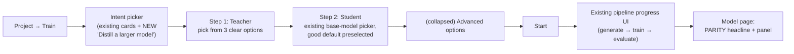

# Distillation Stage 1 — Implementation Plan

> Implements [DESIGN-SPEC.md](DESIGN-SPEC.md) Stage 1 (§5) under the closed decisions (§11).
> Background: [RESEARCH.md](RESEARCH.md).
> Branch: `feat/distillation-stage1`. PRs only — never commit to `main` directly; the user reviews and merges.

---

## 1. UX design (designed first, so the flow stays clean)

### Principles

1. **Three decisions maximum on the happy path:** what to distill *from* (teacher), what to distill *into* (student), go. Everything else has a good default.
2. **Progressive disclosure:** one collapsed "Advanced options" section holds every knob. A user who never opens it gets a correct, safe, good-quality run.
3. **Plain language everywhere.** Never say "SeqKD", "SFT", "black-box". Say "the big model writes the training examples; your small model learns from them."
4. **Warnings inform, requirements block — sparingly.** Only two things can block: missing teacher (it's required by design) and un-acknowledged restricted provider. Everything else is a dismissible hint.
5. **The result reads like an answer, not a dashboard.** The headline after training is one sentence: *"Matches the teacher on 94% of held-out tasks."*

### User journey



### Screen 1 — intent picker (existing screen, one new card)

New card alongside Quick / Production / Reasoning:

> **Distill a larger model**
> Use a big, expensive model to teach a small one you own. You get a small model that behaves like the big one on your task — plus a report proving how close it got.

No new page; same card pattern, same grid.

### Screen 2 — teacher step (the only genuinely new UI)

Radio-card choice, required, nothing preselected (decision §11.1 — explicit choice):

1. **“Use my configured LLM”** — one click; shows host + model it will use (from tenant settings), read-only summary. Filling ≠ silently defaulting: the user still actively picked it.
2. **“Recommended open models”** — short curated list (catalog: permissive Apache-2.0/MIT hosted-API entries) with a one-line “why this one” per entry. Green `allowed` badge.
3. **“Custom endpoint”** — base URL + model + API key fields (key input masked; stored encrypted; “we encrypt this and never display it again”).

Inline behaviors on this step:
- **Policy badge** appears as soon as a teacher is chosen: green `Allowed` / amber `Requires acknowledgment` / grey `Unknown provider`. Amber shows one checkbox: *“I confirm my use of this provider’s outputs for training complies with their terms.”* Start stays disabled until checked. One sentence, no legal wall of text.
- **Judge = teacher notice** (non-blocking, informational): *“Your evaluation judge is the same model as your teacher — comparison scores may be inflated. Consider a different judge in Settings → LLM.”*
- **Cost note** (one line, muted): *“Generation calls use your teacher API key and are billed by your provider.”*

### Step 3 — student + start

The existing base-model picker, unchanged, with the current default preselected. The Start button label reflects the flow: **“Generate from teacher & train.”**

### Advanced options (single collapsed accordion — the ONLY place knobs live)

| Knob | Default | Shown |
| --- | --- | --- |
| Examples per chunk | existing default (5) | always |
| Held-out share for the parity report | existing default (10%) | always |
| Include teacher reasoning traces (CoT) | **off** | only when task type = reasoning; helper text: “Best with open models you host; some providers don’t expose real reasoning and may restrict training on it.” |
| Guidance / facets | existing Data Studio flow | unchanged, linked not duplicated |

Nothing distill-specific beyond these. A closed accordion = a correct run.

### Results UX (model page)

- **Parity headline** at the top of the evaluation section: *“Matches the teacher on 94% of held-out tasks.”*
- Below it, a compact panel: win / tie / loss bar (student vs teacher, judged blind), answer-agreement %, n. Each metric has a plain-language tooltip (e.g. win: “an independent judge preferred your small model’s answer”).
- Rendered **alongside** the existing improvement-over-base metrics, never replacing them (spec rule 5). If parity is high but truth metrics are weak, the existing metrics still tell that story.
- **Empty state** (no golden holdout → no parity): *“No held-out set was kept for this run, so there’s no teacher comparison. Re-run data generation with a held-out share to get a parity report.”*
- Dataset page: small provenance badge — “Generated by {model} @ {host}” with timestamp; tooltip explains why provenance matters.

### Error states (worded for humans)

| Failure | Message |
| --- | --- |
| Teacher endpoint unreachable/permanent error | Existing provider-error surface, prefixed “Your teacher endpoint said: …” |
| Distill selected, no teacher | Inline field error: “Pick the model that will teach yours — this mode needs one.” |
| Restricted provider, no acknowledgment | Checkbox highlighted; Start disabled (no toast spam) |
| Judge unavailable during parity eval | Evaluation fails loudly (existing behavior); parity section shows “Evaluation incomplete — judge unavailable,” never fabricated numbers |

---

## 2. Engineering tasks

Execute in order; each task compiles, passes gates, and commits on its own. Commit author `Dinesh <contactdy14@gmail.com>`, plain messages, no AI attribution, no competitor names anywhere.

### Architecture rules (bind every task)

- **No scattered conditionals.** Distillation must not be a pile of `if mode == "distill"` branches across refine/train/eval/UI. Behavior differences live behind the existing registries (training strategies, datagen registry, eval suites) and the new teacher modules.
- **Typed boundaries over ad-hoc JSON.** `datasets.config.teacher` is read/written only through a typed provenance helper; teacher config only through the teacher modules. No manual `config["teacher"]` pokes outside them.
- **Prefer clean module extraction over minimal patching** when a change would otherwise smear distillation logic across unrelated files — but refactors are *mechanical, test-covered, and land in Task 0*, separate from feature commits, so regressions stay attributable.
- **Wire compatibility is non-negotiable:** Temporal payloads evolve by trailing optional fields only. Clean types (e.g. `EvaluationContext`) are constructed in-process from those fields — never by breaking input shapes.
- **No speculative abstractions.** Design seams the spec needs (Stages 1–3); do not implement futures ("re-answer existing dataset") beyond leaving the seam obvious.

### Task 0 — Preparatory module extraction (refactor, no behavior change)

**Files:** new `crates/api/src/services/teacher/` (mod: `policy.rs`, `config.rs` — DTO, validation, encrypt/sanitize, provenance extraction); new `apps/workers/src/teacher/` (config parsing, URL-guard wiring, in-memory decryption, OpenAI-compatible client factory, key-safe logging); new typed provenance helper (workers + Rust) for `datasets.config.teacher`; `EvaluationContext` dataclass in workers eval.

- Pure extraction/creation — zero behavior change; existing tests stay green untouched.
- `TeacherClient` (workers): the only place a teacher key is decrypted; guarantees URL guard runs before any request and that request logging can never include credentials (unit-tested: log output contains no key material).
- `EvaluationContext { mode, dataset_config, job_config }` constructed inside `run_evaluation` from activity input fields; suites receive it instead of growing positional args.
- Gates: full existing suites pass unmodified. Commit: `Extract teacher and evaluation-context modules`

### Task 1 — Shared enum + deploy-gate metric (Rust)

**Files:** `crates/shared/src/enums.rs`, `crates/api/src/services/deploy_gate.rs`, `crates/api/src/config.rs`

- Add `TrainingMode::Distill` (string form `"distill"`, consistent with existing serde/ts-rs pattern). Grep every `match` on `TrainingMode` (`dto/training_job.rs`, `services/training_job_service.rs`, routes) and handle it — semantics of `Quick` (SFT) unless a site is judge-specific.
- Add `GateMetric::TeacherParity`: `label()` `"teacher parity"`, `extract()` reads `scores.teacher_parity.parity` (f64, 0..1). Mirror the `DocKnowledgeLift` implementation end-to-end.
- `from_thresholds(..., min_teacher_parity: Option<f64>)` appended; `None` = not gated (report-only default, decision §11.2). Config `deploy_min_teacher_parity` ← `DEPLOY_MIN_TEACHER_PARITY`.
- Tests: metric included/excluded by threshold presence; extraction from fixture `{"teacher_parity": {"parity": 0.92}}`; missing section fails closed **only when gated**.
- Gates: `cargo test -p platform-api`, `cargo clippy --workspace -- -D warnings`, `make typegen` (TS union gains `"distill"`).

### Task 2 — Migration + persistence (Rust)

**Files:** `crates/db/src/migrations/029_training_teacher_config.sql`, `crates/db/src/models.rs`

```sql
ALTER TABLE training_jobs ADD COLUMN teacher_config JSONB;
COMMENT ON COLUMN training_jobs.teacher_config IS
  'Distill mode: teacher endpoint/model provenance. api_key value is SecretCipher-encrypted (enc:v1).';
```

- Dataset provenance uses the existing `datasets.config` JSONB under `config.teacher` — no schema change. There is no `datasets.metadata` column in the current schema.
- Follow migration 027/028 conventions; verify on fresh **and** existing local DB (`make migrate`).
- Model: `pub teacher_config: Option<serde_json::Value>` + insert/read sites.

### Task 3 — Teacher DTO, provider policy, API validation (Rust)

**Files:** `crates/api/src/services/teacher/` (from Task 0); the refine/full-pipeline + training request DTOs (`TriggerRefineRequest`, `TriggerFullPipelineRequest`, `CreateTrainingJobRequest`); `pipeline_service.rs` / `training_job_service.rs`

- `TeacherConfigDto { api_base_url, api_key: Option<String>, model, tos_acknowledged: Option<bool> }` — `#[derive(TS)] #[ts(export)]`; `#[ts(optional)]` on options. Key accepted in requests only; **never serialized into any response** (responses expose host + model only).
- `classify_provider(&str) -> ProviderPolicy { Allowed | Restricted | Unknown }`: const list of known proprietary API hosts → `Restricted` (hosts only, no company names in comments); catalog entries → `Allowed`; else `Unknown`.
- Service rules (unit-tested): mode == `Distill` ⇒ teacher required (400, message matches UX copy); `Restricted` ⇒ `tos_acknowledged == Some(true)` required (400 carries the policy so the UI can render the checkbox state); key encrypted with the existing `SecretCipher` before persist AND before inclusion in the Temporal workflow input; policy string returned in the start response for the badge.
- **Durable-secret boundary:** decrypted teacher keys must never enter workflow history, checkpoints, S3, dataset provenance, audit payloads, API responses, or logs. Only `enc:v1` values may cross durable boundaries; activities decrypt in memory immediately before the teacher call.
- Audit: reuse the existing audit-log call sites for job launch, adding teacher host+model to the audit payload.

### Task 3.5 — Flow contract: distill always owns teacher datagen

Distillation Stage 1 is not "train any existing dataset in a new mode." It is "teacher writes the training examples, then the student trains on them." Encode that contract explicitly:

- The primary UI path starts a teacher-backed refinement/datagen run first, then creates the `Distill` training job against that dataset.
- Full-pipeline mode passes the same `teacher` block into refinement and training config, so provenance and job records agree.
- If a user tries to create a `Distill` training job against a dataset without `config.teacher`, reject with a clear 400: "This dataset was not generated by a teacher. Re-run data generation with a teacher to distill from it."
- Future "re-answer an existing dataset's prompts with a teacher" is allowed by the design spec, but is out of scope for this Stage 1 implementation unless implemented as a teacher-backed datagen activity that writes a new dataset with provenance.

### Task 4 — Teacher-driven datagen + provenance (workers)

**Files:** `apps/workers/src/activities/generate_pairs.py`, `apps/workers/src/workflows/refine.py`, `apps/workers/src/workflows/datagen.py`, `apps/workers/src/activities/build_dataset.py`, tests

- `GenerateSyntheticPairsInput` gains trailing optional `teacher: dict | None` (append-only for Temporal payload compatibility). When present:
  - The **pair-generation** answer model is obtained through the datagen registry with a `TeacherClient` (Task 0) — no inline conditionals in `generate_pairs`; the registry seam decides which model writes answers. Facet extraction/expansion and any judge/faithfulness calls **stay on tenant config** — the teacher only writes answers.
  - URL guard + key decryption happen inside `TeacherClient` — by construction, not by call-site discipline.
  - `include_cot` honored only when explicitly true (decision §11.4).
  - Teacher params fold into the checkpoint `_run_key` so changing teacher invalidates stale checkpoints.
- `BuildDatasetInput` gains trailing optional `teacher_provenance: dict | None`. `build_dataset` writes a write-once provenance block into `datasets.config.teacher`: `{"host", "model", "policy", "cot": bool, "generated_at"}`. On conflict/update, preserve an existing `config.teacher`; provenance edits require a new dataset.
- Golden holdout: unchanged — its `expected` answers are teacher outputs by construction (no extra storage; spec §5.2 satisfied structurally).
- Tests: teacher override routes generation only; judge stays tenant; both `RefineWorkflow` and `DataGuideWorkflow`/datagen path pass teacher through; url-guard rejection is non-retryable; run-key changes with teacher; provenance block present in `datasets.config.teacher`; existing teacher provenance is not overwritten.
- Gates: `python -m pytest tests/ -x -q`, `ruff check src/`.

### Task 5 — Distill strategy + mode plumbing (workers)

**Files:** `apps/workers/src/activities/train_model.py`

- `@register_strategy("distill")` reusing the `quick` (SFT) strategy implementation (subclass or alias — read lines ~853-875 first; do not duplicate logic). NOT in `_JUDGE_BACKED_MODES`.
- Verify model naming (`{base}-distill-{job8}`) and any mode allow-lists.
- Update `test_train_state_guards` / registration tests.

### Task 6 — TeacherParitySuite (workers eval)

**Files:** `apps/workers/src/activities/run_evaluation.py`, `apps/workers/src/activities/stubs.py`, `apps/workers/src/workflows/evaluate.py`, `apps/workers/src/workflows/full_pipeline.py`, `apps/workers/src/gpu_provider.py`, `apps/workers/modal_app.py`

- New `@register_suite` class. Read two existing suites end-to-end first (~line 370, ~451) for the generate/judge/score conventions.
- Runs only for distill jobs, decided from `EvaluationContext` (Task 0) — provenance/job-config driven, not fragile string checks in the suite. Wire: trailing optional fields on `RunEvaluationInput` (mode, dataset/job config refs), threaded through `EvaluateWorkflow.run`, local/Modal `GpuProvider.run_evaluation`, `modal_app.run_evaluation`, and `FullPipelineWorkflow`; the context object is built in-process. Non-distill → contributes no scores (not zeros).
- Per golden-holdout item: student generates; `judge.compare_ab(prompt, student, teacher_answer)` (blind) → win/tie/loss; `judge.check_correctness(student, teacher_answer)` → agreement.
- Emits `scores["teacher_parity"] = {"parity": (wins+ties)/n, "win_rate", "tie_rate", "agreement", "n"}`. `JudgeUnavailableError` propagates — never fabricate (matches UX error state).
- Tests with a stub judge: parity math, skip-when-not-distill, judge-failure propagation, n == 0 → no section.

### Task 7 — UI (web) — build §1 exactly

**Files:** training setup flow under `apps/web/src/app/(dashboard)/projects/[id]/` (locate the intent/mode cards by grepping existing labels), evaluation view, dataset view, `api-client.ts`

- Implement Screen 1 card, Screen 2 teacher step (3 radio-cards, policy badge, acknowledgment checkbox, judge==teacher notice, cost note), advanced accordion additions (CoT toggle gated to reasoning task type), Start-button copy.
- Parity headline + panel with tooltips; empty state; provenance badge. All copy verbatim from §1 (it was written to be shippable).
- Use existing form primitives + zinc palette; no new dependencies; generated types only (no hand-rolled request types).
- Gates: `pnpm type-check`, `pnpm lint`.

### Task 8 — Docs, full gates, PR

- `docs/DEVELOPMENT.md` Production Checklist: add `DEPLOY_MIN_TEACHER_PARITY` (optional; unset = report-only).
- `docs/distillation/DESIGN-SPEC.md`: status line → “Stage 1 implemented”.
- Full gate run: `cargo test --workspace` · `cargo clippy --workspace -- -D warnings` · `cargo fmt --check` · workers `pytest` + `ruff` · web `type-check` + `lint` · `make typegen` diff-clean.
- Push branch, open PR: `Add distillation training mode with teacher-parity evaluation`. High-level description, no internal/security detail, no attribution. **Stop — the user merges.**

---

## 3. Explicitly out of scope (Stage 1)

Hosted teachers on Modal, logprob artifacts, tokenizer hashing, `distill_logit` strategy, per-tenant teacher-GPU spend caps (no hosted teacher yet ⇒ no platform GPU spend), on-policy loop — all Stage 2/3 per the spec.

## 4. Verification of the whole feature (manual, before PR merge)

1. Local run: distill flow with a cheap teacher endpoint on a tiny doc set → dataset carries provenance; golden holdout exists.
2. Train (local GPU or Modal) in distill mode → model name carries `distill`; job row has `teacher_config` with `enc:v1` key.
3. Evaluation produces `teacher_parity` scores; model page shows the headline; deploy works with gate unset; setting `DEPLOY_MIN_TEACHER_PARITY=0.99` blocks deploy with the parity reason.
4. Restricted-host teacher without acknowledgment → blocked at API with the policy error; with acknowledgment → proceeds.
