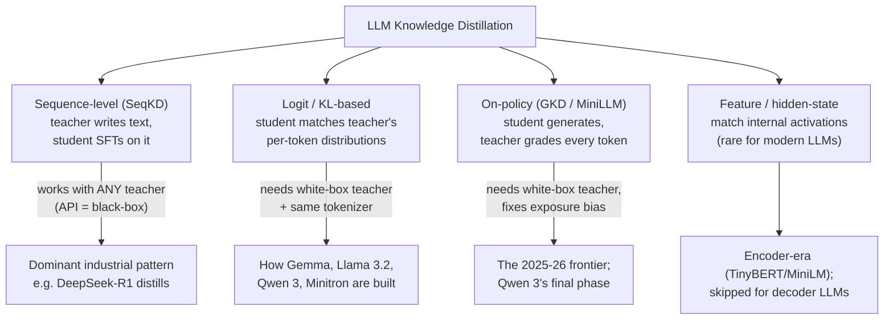

# LLM Knowledge Distillation — Research Notes

> Status: research groundwork for the distillation feature (mid-2026).
> Companion doc: [DESIGN-SPEC.md](DESIGN-SPEC.md) — how we build it on our platform.

---

## 1. Distillation, explained from first principles

**Knowledge distillation (KD)** means using a larger, stronger model (the **teacher**) to train a smaller, cheaper model (the **student**). The goal is not to make the student generally as smart as the teacher. The goal is narrower and more useful: make the student behave like the teacher on the workload we care about.

Think of it as model apprenticeship:

```text
domain prompts + examples
        │
        ▼
big teacher model
        │  produces answers, traces, scores, or probabilities
        ▼
training signal
        │
        ▼
small student model
        │
        ▼
cheaper, faster model specialized for this tenant/task
```

A normal fine-tune says: "Here is the correct answer humans wrote. Learn it."

Distillation says: "Here is how a stronger model handles this situation. Learn its behavior."

That distinction matters because a strong teacher can provide more than final answers. It can provide style, formatting discipline, tool-call patterns, reasoning traces, fallback behavior, refusal behavior, and in white-box settings, token-by-token probability judgments.

### 1.1 Why do this at all?

Production AI workloads are often narrow. A tenant might need a model that drafts support replies, extracts fields from insurance documents, routes tickets, answers from internal docs, or performs one type of agent step. Calling a frontier teacher for every request is expensive and slow. Distillation lets us spend teacher/GPU cost once during training, then serve most future calls with a small owned model.

The trade is:

```text
before: every production request pays frontier-model latency/cost
after:  training pays teacher cost once, serving uses a small specialized student
```

Why it has become one of the most heavily used post-training techniques in industry:

- **The economics.** A 1-8B student that matches a huge teacher on a specific task can cost a fraction per call, run faster, and be hosted on our own hardware or on-device.
- **The proof is in model families.** Many strong small open models are distilled from larger siblings: Gemma 2/3, Llama 3.2 1B/3B, Qwen 3 small models, DeepSeek-R1's distilled variants, and NVIDIA Minitron.
- **It is often cheaper than RL for similar post-training goals.** On-policy distillation gives dense token-level supervision from the teacher, while RL usually gets sparse reward signals. Qwen 3 reports roughly 1/10 the GPU hours of direct RL for its on-policy phase.

### 1.2 What exactly gets transferred?

There are three levels of teacher signal, from easiest to richest:

| Signal | What the student sees | Example | Requires |
| --- | --- | --- | --- |
| **Text** | The teacher's final answer | "Refunds take 5-7 business days." | Any API teacher |
| **Trace / rationale** | The teacher's answer plus reasoning/tool trajectory | Analyze → call tool → synthesize answer | Teacher terms must allow traces |
| **Logits / logprobs** | The teacher's probability distribution at each token | "Paris" 0.95, "Lyon" 0.02, "banana" tiny | Self-hosted white-box teacher |

Text is easy and works everywhere. Logits are much richer but require self-hosting the teacher.

### 1.3 The core intuition: dark knowledge

Suppose the prompt is:

```text
The capital of France is
```

A hard training label only says:

```text
Paris = correct
everything else = wrong
```

A teacher distribution says something more informative:

```text
Paris  0.95
Lyon   0.02
Rome   0.005
banana 0.000001
```

Those "wrong" probabilities are not random. They encode similarity and judgment. The teacher knows Lyon is a French city and banana is nonsense. A one-hot label destroys that structure; a logit-distillation loss preserves it. Hinton called this extra information **dark knowledge**.

This is the simplest reason logit KD can beat plain SFT on teacher text: the student is not just learning what the teacher said, but how the teacher ranked alternatives.

### 1.4 Distillation is not magic

Distillation does **not** guarantee the student becomes as capable as the teacher. The student can only absorb what its size, architecture, data, and training budget allow. It can also inherit teacher mistakes, bias, unsafe behavior, or bad calibration.

For a production platform, the practical goal is therefore not "teacher cloned." The goal is:

```text
high teacher parity on tenant tasks
+ good truth metrics on holdouts
+ acceptable safety/regression results
+ lower serving cost/latency
```

That is why the design spec treats teacher parity as evidence, not proof of correctness.

---

## 2. The vocabulary you need

| Term | Meaning | Example |
| --- | --- | --- |
| **Teacher** | The big/strong model whose behaviour we want to copy | Qwen3-32B, or any OpenAI-compatible endpoint |
| **Student** | The small model being trained | Qwen3-1.7B with a LoRA adapter |
| **Black-box teacher** | Teacher you can only get *text* from (an API) | A hosted chat-completions endpoint |
| **White-box teacher** | Teacher whose per-token probabilities (logits/logprobs) you can read | A model you host yourself on vLLM |
| **Logits / logprobs** | The model's scores over every possible next token, before/after softmax | For "2+2=", teacher gives " 4" p=0.99, " 5" p=0.001, ... |
| **Hard label** | A single "correct" token/text used in normal SFT | The dataset answer string |
| **Soft label / soft targets** | The teacher's full probability distribution used as the target | The whole top-k logprob vector per position |
| **Off-policy** | Student trains on *someone else's* text (teacher's or dataset's) | Classic SFT on teacher outputs |
| **On-policy** | Student trains on *its own* generations, graded by the teacher | GKD: student writes an answer, teacher scores every token of it |
| **Exposure bias** | Failure mode of off-policy training: student never saw its own mistakes, so errors compound at inference | Student's step-3 tool call goes slightly wrong → steps 4+ are out-of-distribution → cascade |
| **Temperature (T)** | Softmax flattener; T>1 amplifies the near-miss tokens so they carry gradient signal | At T=1 teacher looks one-hot (0.99 Paris); at T=3 alternatives become visible |
| **Top-k truncation** | Keeping only the teacher's k most likely tokens per position (the rest zeroed/renormalized) | Gemma 3 uses 256 logits per token |
| **Forward KL** | KL(teacher‖student): "cover everything the teacher might say" — mode-covering | Student spreads mass; risks bland/hallucinated text |
| **Reverse KL** | KL(student‖teacher): "never say what the teacher wouldn't" — mode-seeking | Student stays sharp; the MiniLLM/GKD default for generation |
| **SeqKD** | Sequence-level KD: teacher writes full outputs, student does plain SFT on them | "Generate 5k answers with the teacher, fine-tune on them" |
| **GKD** | Generalized Knowledge Distillation: the on-policy algorithm (student samples, teacher grades per-token) | TRL's `GKDTrainer` |
| **Parity** | How close the student is to the teacher *on your data*, measured | "Student matches teacher on 94% of held-out tasks" |

---

## 3. The four distillation types

The easiest way to understand the types is to ask: **what teacher signal is available, and who generates the text being trained on?**



### 3.0 Quick decision map

| Situation | Use this | Why |
| --- | --- | --- |
| Teacher is a proprietary API | **SeqKD** | You can get text, not useful token distributions |
| Teacher and student have exact tokenizer/template match, and teacher is self-hosted | **Offline logit KD** | Richer signal, still fits a batch pipeline |
| Student fails at multi-step/tool trajectories because it drifts from teacher-perfect examples | **On-policy KD** | Student trains on its own mistakes |
| Teacher and student are different model families | **SeqKD** | Token-level KL is undefined without cross-tokenizer research methods |
| You need a first shippable product surface | **SeqKD + parity report** | Simple, useful, works with any tenant teacher |

### 3.1 Sequence-level / response-based (SeqKD) — "black-box distillation"

The teacher writes complete answers. We save those answers as a dataset. The student is trained with ordinary SFT on that dataset.

```text
  prompt ──► TEACHER ──► "full answer text" ──► dataset ──► SFT ──► STUDENT
             (any API)                          (JSONL)
```

Example:

```text
Prompt:
  "A customer says their package arrived damaged. Draft a support response."

Teacher answer:
  "I'm sorry your package arrived damaged..."

Student training row:
  input = prompt
  output = teacher answer
```

This is the only option when the teacher is a normal API and does not expose useful logits. It is also the right first product stage because it reuses the SFT stack.

- **Strengths:** simplest; works cross-family and cross-tokenizer; reuses the entire existing SFT stack.
- **Weaknesses:** transfers only *one sample* per prompt, discards dark knowledge; off-policy (exposure bias).
- **Real-world example:** DeepSeek-R1 → Qwen/Llama students: pure SFT on ~800K R1-generated samples (600K reasoning + 200K general). No RL, no logits — and the distilled 7B hits 55.5% on AIME'24.
- **Reasoning distillation** is SeqKD where the teacher's output includes reasoning traces/rationales; the student learns to *reason in the teacher's style*, not just answer. For a platform, storing and training on traces should be opt-in and limited to teachers whose license/terms explicitly allow it.

### 3.2 Logit / KL-based — "white-box distillation"

Instead of saving only the teacher's final text, we ask the teacher: "At this token position, how likely was every next token?" The student is trained so its distribution matches the teacher's distribution.

```text
              position t:  "The capital of France is"
  TEACHER  ─► top-k logprobs:  [" Paris" 0.95, " Lyon" 0.02, " the" 0.01, ...]
                                        │  KL loss per position
  STUDENT  ─► its own logprobs:  [" Paris" 0.80, " Lyon" 0.05, " a" 0.04, ...]
                                        ▼
                     gradient: shift student distribution toward teacher's
```

This is the first "real KD" method many ML papers mean when they say distillation, because it transfers dark knowledge. It needs a white-box teacher, usually self-hosted with vLLM, and the teacher/student tokenization must match exactly enough for token-level comparison.

- **Requires:** a white-box teacher (you host it, e.g. on vLLM which exposes logprobs) **and** — normally — a **shared tokenizer** (see §5).
- **Strengths:** much more signal per token; how the strongest small models are actually built (Gemma 2/3, Llama 3.2, Qwen 3, Minitron).
- **Key recipe detail (Gemma 3):** sample/keep **256 logits per token** weighted by teacher probabilities, zero and renormalize the rest.
- **How much top-k is enough:** research says beware — fewer than ~25 kept tokens can be *worse than no distillation*; performance approaches full-KD around ~300. The industrial sweet spot is **~128–320 logprobs per position**. API teachers capping `top_logprobs` at 20 (or 5–8 at some providers) are *below the useful threshold* — a core reason API-teacher distillation stays sequence-level.

### 3.3 On-policy distillation (GKD / MiniLLM) — fixing exposure bias

SeqKD and offline logit KD are usually **off-policy**: the student trains on teacher-perfect text. At serving time, the student must continue from its own imperfect text. That mismatch is called **exposure bias**.

Example:

```text
Training:
  teacher writes step 1 correctly
  teacher writes step 2 correctly
  teacher writes step 3 correctly

Serving:
  student writes step 1 slightly wrong
  now step 2 is conditioned on a prefix the teacher never produced
  by step 3, the trajectory can collapse
```

On-policy distillation fixes this by making the student generate its own answer first. Then the teacher scores the student's actual tokens. The model learns from the mistakes it really makes.

**The GKD loop, concretely, each training step:**

```text
   ┌───────────────────────────────────────────────────────────────┐
   │ 1. Flip a λ-weighted coin per batch:                          │
   │      with prob λ   → STUDENT generates the sequences          │
   │      with prob 1-λ → take fixed dataset/teacher sequences     │
   │        (λ=1 pure on-policy, λ=0 = supervised KD)              │
   │                                                               │
   │ 2. TEACHER does ONE FORWARD PASS over those sequences         │
   │      → per-token teacher distributions (no generation!)       │
   │                                                               │
   │ 3. Per-token divergence loss at every position:               │
   │      forward KL / reverse KL / generalized JSD(β)             │
   │      gradients flow ONLY through the student                  │
   │                                                               │
   │ 4. Update student → next batch comes from a better student    │
   │      → train/inference mismatch shrinks toward zero           │
   └───────────────────────────────────────────────────────────────┘
```

- It is effectively **RL with a dense per-token reward** of "agree with the teacher" — but ~10–30× cheaper than real RL because supervision is per-token, not one bit at the end.
- **Efficiency evidence:** on-policy GKD with 5% of the data beats supervised KD on the full dataset.
- **Production template (Qwen 3):** phase 1 *off-policy* (SFT on teacher responses) → phase 2 *on-policy* (student generates, aligns its logits to the teacher's via KL). This two-phase recipe is the best-documented production template to date.
- **Implementations:** TRL `GKDTrainer` (lambda/beta = λ / JSD interpolation), verl's OPD (top-k teacher logprobs "lightweight like a reward").

### 3.4 Feature / hidden-state distillation — why we skip it

Feature distillation tries to match the teacher's internal activations or attention maps, not just outputs. This was useful for older encoder models like TinyBERT/MiniLM.

For our LLM platform, it is not the right product surface:

- API teachers do not expose hidden states.
- Different architectures have different layer shapes, so mapping teacher layers to student layers is fragile.
- For decoder LLMs, logit KD captures the useful external behavior with a cleaner implementation path.
- It is still relevant for some embedding/compression work, but not for our first distillation feature.

### 3.5 The production ladder for our platform

The practical build order is:

```text
Stage 1: SeqKD
  works with any teacher endpoint
  creates teacher-generated dataset
  trains with existing SFT path
  produces teacher-parity report

Stage 2: Offline logit KD
  requires self-hosted open-weight teacher
  extracts top-k logprobs with prompt_logprobs
  trains with KL + CE
  improves fidelity when tokenizer/template match

Stage 3: On-policy KD
  requires coordinated student generation + teacher scoring
  targets agents, tool use, multi-step reasoning
  highest complexity, highest upside
```

That ladder is the core product decision: start with the method every tenant can use, then add richer methods when the teacher is open-weight and self-hostable.

---

## 4. The technical knobs (the "real meat" questions, answered)

### Forward vs reverse KL — why reverse keeps students sharp

- **Forward KL** `KL(p_teacher ‖ q_student)` is **mode-covering**: the student is penalized wherever the teacher has probability mass the student doesn't. An under-capacity student responds by *smearing* probability over all the teacher's modes — producing text the teacher itself would rate unlikely (bland, hallucination-prone).
- **Reverse KL** `KL(q_student ‖ p_teacher)` is **mode-seeking**: the student is only penalized on tokens *it* assigns mass to — so it concentrates on high-probability teacher regions and *never learns to say what the teacher wouldn't*. This is MiniLLM's core move, and GKD's ablations confirm mode-seeking trades a little diversity for a lot of quality.
- **Generalized JSD(β)** interpolates between the two when the student badly lacks capacity.

```
 teacher distribution:      ██    ██        ██     (three modes)
 forward-KL student:        ▓▓▓▓▓▓▓▓▓▓▓▓▓▓▓▓▓▓     (covers all, sharp nowhere)
 reverse-KL student:              ████              (picks a mode, stays sharp)
```

### Temperature

Dividing logits by T>1 before softmax flattens both distributions so near-miss tokens aren't drowned by the argmax token — that's where the dark knowledge lives. Classic guidance: T≈2–4 for small students. Caveat for on-policy methods: the *distillation* temperature usually stays ≈1 (the student must match the real inference-time distribution); the *sampling* temperature of student rollouts is a separate knob.

### Top-k truncation (how many logprobs are enough)

- <25 kept tokens: can be **worse than no distillation at all**.
- ~99.99% of probability *mass* is inside top-32 — but the **decision-critical token can still be missing** (documented failure: the token that flips a tool call). Naive top-k reverse KL is also statistically biased without a correction term.
- ≈300 approaches full-KD quality; **industrial sweet spot ~128–320** (Gemma 3 uses 256).
- Consequence: API teachers offering ≤20 logprobs are unusable for serious logit KD → logit KD implies **self-hosted teacher**.

### Mixing with hard-label CE (α)

`loss = α·CE(hard labels) + (1−α)·T²·KL(soft targets)` — the T² keeps gradient scales comparable; the CE term anchors the student to real data so it doesn't inherit teacher quirks wholesale. Hinton's guidance: weight the soft-target term high (it carries richer, lower-variance gradients).

---

## 5. Tokenizer alignment — the practical constraint on logit KD

**Why it's required:** token-level KL compares distributions *at the same position over the same vocabulary*. Different tokenizers segment text differently ("distillation" = 1 teacher token but 3 student tokens): positions misalign, vocabularies don't match, the loss is undefined.

**Consequence:** logit KD normally happens **within a model family** — Qwen-big → Qwen-small, Llama-big → Llama-small. That's how every documented industrial case does it.

**Cross-tokenizer workarounds (research → early-practical):**

| Method | Idea | Practicality (mid-2026) |
| --- | --- | --- |
| ULD | Optimal-transport loss on *sorted* logit vectors (ignores token identity) | Usable but crude |
| Multi-Level OT | Sequence + vocabulary-level transport | Research |
| ALM | Match likelihoods of byte-span-aligned token chunks | Research, promising |
| **GOLD** | On-policy GKD across tokenizers, **shipped in TRL** | The first mainstream-packaged option |
| Byte-level bridges | Byte-prefix marginalization for cross-tokenizer OPD | 2026 research |

**Verdict:** stay in-family for logit KD; cross-family, use SeqKD (that's exactly what DeepSeek-R1→Llama did). GOLD is the one cross-tokenizer option worth watching since it's in TRL.

---

## 6. 2025–2026 frontier (what's new)

- **On-policy distillation went mainstream:** in production post-training (Qwen 3), in libraries (TRL GKDTrainer, verl OPD), and quantified at ~10–30× cheaper than RL for matched results.
- **Agent/tool-call distillation** is the hot application: full-trajectory distillation into 0.5–3B students; structured span-specific losses ([REASON]/[ACT]); student-generates-teacher-corrects-first-error schemes.
- **Step-wise on-policy distillation (SOD, 2026):** for tool-using agents, one bad tool call cascades; SOD reweights distillation strength per step by student-teacher divergence at that step.
- **Top-k truncation caution for tool calls (2026):** top-32 logprobs can silently drop the token that decides a tool call — directly relevant to our tool-call track.
- **Speculative decoding synergy:** the best draft models are distilled on-policy from their own generations (DistillSpec: 10–45% extra speedup) — a future serving optimization for us.

---

## 7. Documented industrial recipes (primary-source table)

| Family | Method (officially documented) |
| --- | --- |
| **Gemma 2** (2B/9B) | Token-level logit KD for the *entire pre-training run*; beats from-scratch at equal token budget |
| **Gemma 3** | Logit KD pre+post-training; 256 logits/token truncation recipe |
| **Llama 3.2** (1B/3B) | Prune Llama-3.1-8B, then logit-KD retraining against 8B & 70B teachers |
| **Qwen 3** (0.6B–14B) | Two-phase "strong-to-weak": off-policy SFT on teacher text → on-policy logit KL; ~1/10 GPU-hours of direct RL |
| **DeepSeek-R1 distills** | Pure SeqKD: SFT on ~800K R1 traces, cross-family (Qwen & Llama students), no logits |
| **NVIDIA Minitron** | Prune + logit KD: 40× fewer tokens than from-scratch, +16% MMLU |

**The pattern, plainly:**
- *In-family compression* → **logit KD** (Gemma, Llama 3.2, Qwen 3, Minitron)
- *Cross-family capability transfer* → **SeqKD on teacher traces** (R1 distills)
- *Frontier post-training 2025-26* → **off-policy SFT phase + on-policy logit phase** (Qwen 3 template)

---

## 8. Libraries & practical recipes

### 8.1 The trainer landscape (mid-2026)

| Library | What it offers | Verdict for us |
| --- | --- | --- |
| **TRL `GKDTrainer`** | On-policy GKD (`lmbda` = on-policy fraction, `beta` = JSD interpolation 0≈forward-KL → 1≈reverse-KL, `seq_kd` flag). LoRA students via `peft_config`. Teacher must fit on training GPUs, same tokenizer. | Solid, but superseded by ↓ |
| **TRL `DistillationTrainer`** | The production-oriented successor: **teacher-server mode** (teacher on a separate vLLM server → 70B+ teachers without fitting on training GPUs, binary logprob payloads), generation buffering via vLLM (~large speedups for on-policy), Liger fused JSD, LoRA supported. Defaults: reverse KL (`beta=1.0`), `temperature=1.0`. Important server-mode constraint: remote-teacher reverse KL/JSD currently uses top-1 sampled support; richer top-k is for forward KL or local/colocated teachers. | **Primary candidate for on-policy experiments; use deliberately for offline/logit stages** |
| **TRL `GOLDTrainer`** | Cross-tokenizer on-policy logit KD (ULD + span alignment + hybrid loss). Experimental. | The only real cross-tokenizer option; watch, don't depend |
| **axolotl KD plugin** | **Offline top-k-logprob KD**: pre-collect teacher top-k logprobs with vLLM into the dataset (`logprobs_field`), then train decoupled from the teacher. `kd_ce_alpha`/`kd_alpha`/`kd_temperature`. Works with their LoRA/QLoRA stack. | The cleanest *offline* logit-KD design — its decoupled architecture matches our Temporal pipeline shape well |
| **torchtune KD recipes** | Clean forward-KL + CE (`kd_ratio`), LoRA configs for Llama pairs. | **Maintenance mode since mid-2025 — do not build on it** |
| **Unsloth** | No KD trainer. Pattern: Unsloth student inside a TRL trainer, or plain SFT on teacher outputs (SeqKD). | Our engine stays for loading/LoRA; KD loss comes from TRL |
| **Arcee DistillKit** | Logit KD + hidden-state variants; their report: logit > hidden-state > SFT-only. | Reference implementation to read |
| **NVIDIA NeMo/Minitron** | Prune-then-distill at Megatron scale. | Too heavyweight for LoRA pipelines |

Managed services are emerging for hosted on-policy distillation (a signal this is going mainstream), but the OSS TRL path covers us.

### 8.2 Getting teacher signals — the practical reality

- **Proprietary/hosted OpenAI-compatible APIs:** `top_logprobs` are usually capped at **20** or lower (some providers 5–8; one aggregator study found only ~23% of endpoints actually return them; some providers' logprobs are broken; Anthropic offers none). They generally lack `prompt_logprobs`, so you can't teacher-force-score arbitrary text through those providers.
- **Self-hosted vLLM is the real answer:** `logprobs=k` for outputs *and* `prompt_logprobs=k` for teacher-forced scoring of arbitrary text (the killer feature for KD), `--max-logprobs` configurable. Treat this as the white-box teacher path even though the HTTP surface can still be OpenAI-compatible.
- **Consequence for design:** *text-only (SeqKD) works with any configured endpoint; logit/on-policy KD implies a self-hosted open-weight teacher on vLLM* — which we can spin up per-job on Modal like any training job.

### 8.3 What people actually run (the recipes)

- **R1-style reasoning distillation** — SFT on curated teacher CoT traces — is >90% of real-world "distillation" today. Data budgets observed: **~1K ultra-curated traces** (s1: near-o1-preview from 1,000 examples — curation dominates volume), **10–100K** for a typical domain distill, 800K–1.4M for frontier-general reasoning. Platform sweet spot: **tens of thousands of teacher completions**.
- **When is logit KD worth it over SFT-on-teacher-text?** Evidence says: logit > SFT-only consistently (DistillKit, torchtune ablations), but **Apple's distillation scaling laws** (ICML 2025) caution that distillation beats supervised training only when the teacher already exists/is amortized. Emerging decision rule: **start with SeqKD (works with any API), add logit/on-policy as a stage-2 when the teacher is self-hostable, same-family, and you need the last few points of quality.**
- **On-policy headline result** (the most influential practical writeup, late 2025): SFT-400K gets a Qwen3-8B to 60% on AIME'24; adding on-policy distillation with ~77K prompts → **70%, matching the RL recipe at ~1/10 the GPU-hours** (1,800 vs 17,920). Also the best-documented fix for **catastrophic forgetting**: distill from the model's own earlier version to recover lost general behaviour while keeping new domain knowledge.
- **Counterpoint to keep us honest:** on-policy KD is *not* uniformly better — gains depend on the student-teacher gap and task (2026 analysis).

### 8.4 Typical hyperparameters (starting points)

| Knob | Common values |
| --- | --- |
| Distill temperature | 1.0 (modern default; classic 2–4 advice applies less to LLM KD) |
| CE/KD mix | `kd_ce_alpha≈0.1` / `kd_alpha≈0.9` (axolotl); `kd_ratio` 0.25–0.5 (torchtune) |
| Divergence | forward KL for off-policy teacher-forced; **reverse KL for on-policy** |
| On-policy fraction λ | 1.0 (fully on-policy) generally best |
| LR | 2e-5 full-model SFT-style; 3e-4 LoRA KD |
| Rollout sampling | temp 0.9–1.0, top_p 0.95 |

### 8.5 Teacher hosting cost (per-job, scale-to-zero — fits our Modal pattern)

| Teacher | Precision | GPUs | Approx. rate |
| --- | --- | --- | --- |
| 32B | fp8 | 1×H100 | ~$4/hr |
| 32B | int4 | 1×A10G/L40S | ~$1–2/hr |
| 70–72B | fp8 | 2×H100 | ~$8/hr |
| 70–72B | bf16 | 2×H100/4×A100-80 | ~$8–10/hr |

Throughput: 70B-class on vLLM ≈ thousands of tok/s aggregate → **1B generated tokens ≈ 60–90 H100-hours (a few hundred dollars)**; a realistic platform job (tens of thousands of completions) is **single-digit dollars to low tens**. KV cache is the silent VRAM killer at long context — KD jobs control context, so 8–16K budgeting is fine. Cold-start on huge weights is the main serverless friction (mitigate with volumes/fp8 checkpoints).

### 8.6 Measuring "how much of the teacher survived" (parity report patterns)

The emerging standard bundle — exactly what our parity report should contain:
1. **Teacher-recovery rate** — student score ÷ teacher score per benchmark (the de facto headline: "retains >95% of teacher").
2. **LLM-judge win/tie-rate vs the teacher** on held-out domain prompts (for open-ended tasks benchmarks don't cover).
3. **Token/answer-level agreement + KL vs teacher** on a fixed eval set (direct fidelity; on-policy work tracks per-token reverse KL itself).
4. **Capability-preservation audit** — check the *specific* teacher capabilities the use case needs, not just aggregate scores (2026 papers formalize this; complements our golden-holdout design).

## 9. Industry trends, licensing & platform considerations

### 9.1 Where the industry is (mid-2026)

- **On-policy distillation is increasingly displacing RL for small/mid-model post-training.** Documented in Qwen 3's tech report (strong-to-weak: off-policy SFT phase → on-policy logit phase, ~1/10 the GPU-hours of RL), and reported for DeepSeek-V4 (on-policy distillation from domain-specialist teachers in place of RL) and several other 2026 open releases (secondary-source reporting; treat specific lab counts as indicative, not verified). A platform whose distillation is SFT-only trails the frontier recipe — but SFT-on-teacher-traces remains what the large majority of *practical* users need first.
- **The SLM-in-production thesis is mainstream:** the influential position is that most agent invocations should run on small owned models (10–30× cheaper), with an explicit pipeline — log agent calls, cluster, fine-tune an SLM per sub-task. Reported economics: break-even vs frontier APIs within weeks at moderate volume; on-device SLMs (1–4B) hitting <50ms first-token on laptop NPUs.
- **Major cloud providers now ship managed distillation offerings** (teacher+student picker, synthetic data generation from your prompts, integrated evals). The category is validated; the room left is neutrality (any teacher, any student), eval/calibration rigor, and data-quality tooling.
- **Teacher access is bifurcating:** proprietary APIs increasingly hide/summarize reasoning traces and cap logprobs — and research now exists on deliberately *poisoning* traces against distillation (antidistillation sampling). Open-weight teachers allow everything. This creates a real product distinction: **text-level KD from any API vs full logit/on-policy KD from self-hosted open teachers.**
- **Quality gates beat volume:** the strongest results (Phi-4 exceeding its teacher via curated synthetic data; s1's 1K-example distill) show data curation/rating layers are the differentiating asset — which is exactly our Data Studio + judge + topic-tree surface.

### 9.2 Safety & trust findings a platform must respect

- **Subliminal learning:** teachers can transmit behavioral traits (including misalignment) through semantically *unrelated* training data; filtering does not remove it; it does **not** transfer across different base families. Implication: same-family distillation carries hidden-trait risk — worth a note in docs and a reason parity evals matter.
- **Calibration collapse:** 2026 work shows on-policy distillation transfers capability but can destabilize confidence calibration. Implication: our eval layer should eventually measure calibration (ECE), not just accuracy.
- **Benchmark contamination** in teacher-generated data — keep golden holdouts strictly separated from teacher-generated training data (our holdout design already does this).

### 9.3 Licensing / ToS (what the platform must know)

**Proprietary API terms — all major providers prohibit competitive distillation:**

- OpenAI: outputs may not be used to "develop models that compete."
- Anthropic: prohibits training AI models with outputs without written permission — but **explicitly permits** narrow non-competing task models (classification, extraction, summarization, etc.).
- Google: same competitive-use prohibition.
- Legal scholars note these are contract claims of uncertain enforceability, and outputs themselves likely lack copyright — but a platform should not lean on that.

**Open-weight teachers are the safe harbor, at every scale:**

- **Apache-2.0:** the entire Qwen open family; gpt-oss-120b/20b (explicitly released as distillation-friendly, "free of downstream restrictions"); Mistral small models.
- **MIT:** DeepSeek V3/R1/V4 line, GLM, Phi-4.
- **Llama Community License:** explicitly *allows* using Llama outputs to improve other models — with the naming condition that derived models' names must begin with "Llama."

**What a neutral platform does (industry consensus):**

1. Teacher endpoint is user-configurable; **ToS compliance is the user's responsibility** — surface a clear notice for proprietary-API teachers.
2. **Default/recommend permissive open-weight teachers** (Apache-2.0 / MIT) — zero ambiguity and post-R1/gpt-oss strong enough for most verticals.
3. Honor the Llama naming clause when Llama is the teacher.
4. **Log teacher provenance per dataset/job** — regulatory attention to API-output provenance is plausible; provenance logging is cheap future-proofing.

---

## Sources

Primary sources are linked inline throughout. Key papers: Hinton et al. 2015 (dark knowledge, [1503.02531](https://arxiv.org/pdf/1503.02531)); Kim & Rush 2016 (SeqKD, [1606.07947](https://arxiv.org/abs/1606.07947)); GKD ([2306.13649](https://arxiv.org/abs/2306.13649)); MiniLLM ([2306.08543](https://arxiv.org/abs/2306.08543)); ULD ([2402.12030](https://arxiv.org/abs/2402.12030)); ALM ([2503.20083](https://arxiv.org/abs/2503.20083)); Sparse Logit Sampling ([2503.16870](https://arxiv.org/pdf/2503.16870)); top-k tool-call caution ([2607.07050](https://arxiv.org/html/2607.07050v3)); SOD ([2605.07725](https://arxiv.org/abs/2605.07725)); Gemma 2 ([2408.00118](https://arxiv.org/abs/2408.00118)); Gemma 3 report; Qwen 3 ([2505.09388](https://arxiv.org/pdf/2505.09388)); DeepSeek-R1 ([2501.12948](https://arxiv.org/abs/2501.12948)); Minitron ([2408.11796](https://huggingface.co/papers/2408.11796)); DistillSpec ([2310.08461](https://arxiv.org/abs/2310.08461)); Thinking Machines on-policy distillation blog; TRL GKDTrainer & verl OPD docs.
